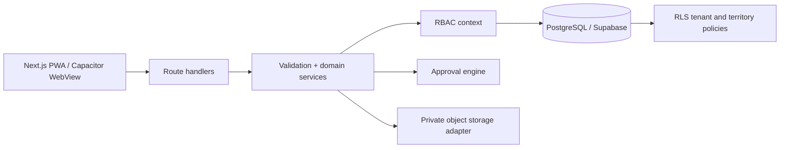
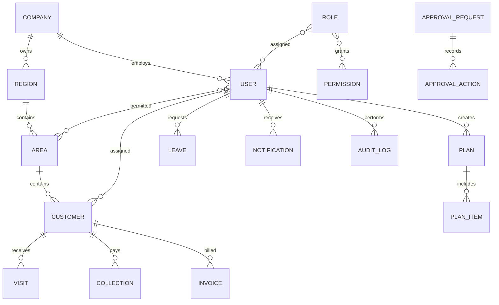

# Architecture

Each request authenticates an opaque, hashed server session. The server derives permissions and allowed area UUIDs from role assignments, then opens one transaction and sets transaction-local `app.company`, `app.user`, `app.permissions`, and `app.areas` values. Queries run through the restricted `fieldforce_app` role; PostgreSQL RLS applies those verified values. The browser never receives records it cannot access.

Collections use a UUID client transaction ID, a tenant unique constraint, a transaction advisory lock, and payload comparison. A retry returns the original transaction; reuse with different values fails. Finance confirmation is an approval decision, not a side effect of submission.

Approval workflows are stored as ordered JSON steps. A submission snapshots the workflow into `approval_requests`, preserving history after an administrator changes the template. Decisions lock the request and entity rows; self approval and duplicate decisions fail.

The built-in PGlite adapter runs the same PostgreSQL schema for local evaluation. Production uses `DATABASE_URL` (Supabase PostgreSQL is supported) and refuses local storage unless `ALLOW_LOCAL_DB=true` is explicitly configured.

## Entity relationship overview

Historical activities retain their original representative and area. Customer transfers append to `customer_assignments` and do not rewrite history.

## HTTP surface

| Endpoint | Purpose |
|---|---|
| `POST /api/auth/login|logout|forgot|reset` | Session and password recovery |
| `GET /api/data` | One permission-scoped workspace snapshot |
| `POST /api/customers` | Create a territory-checked customer |
| `POST /api/{visits,collections,invoices,plans,leaves}` | Validate and submit or save a draft |
| `PATCH /api/{module}/{id}` | Submit draft or authorized cancellation |
| `PATCH /api/approvals/{id}` | Serialized approval decision |
| `POST /api/{users,roles,areas,regions,settings,workflow,balance}` | Authorized administration |
| `GET /api/export` | Permission-scoped UTF-8 CSV or Excel export |

All writes validate same-origin requests, input size, schema, permission, tenant and territory. Raw database errors are logged on the server and mapped to a generic client message.

## Deferred integrations

Push notifications, WhatsApp, email campaigns, AI providers, inventory, full accounting, payroll, route optimization, expenses and continuous GPS tracking are extension points. Password reset email delivery uses a configured webhook. Private object-storage metadata and RLS are present; a production Supabase Storage bucket must be provisioned before enabling file uploads.
